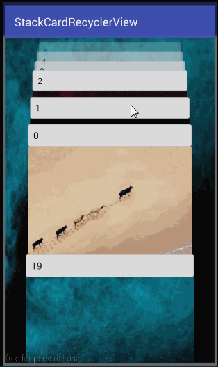
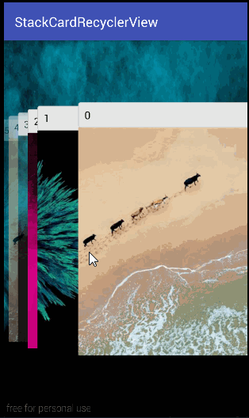
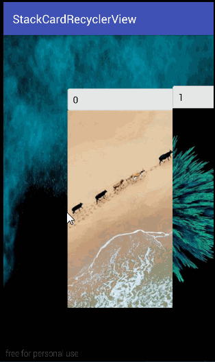
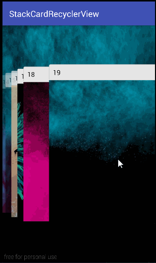
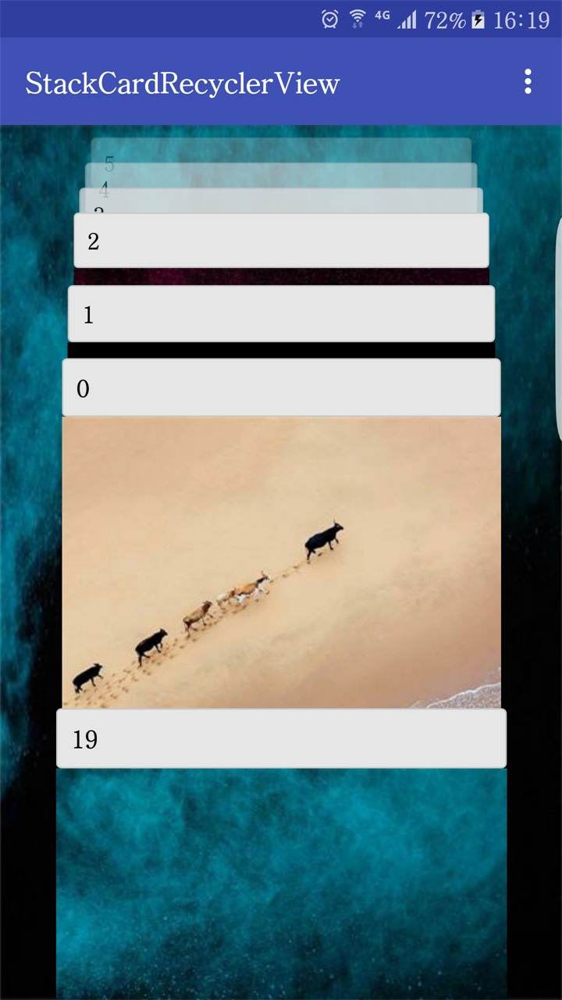
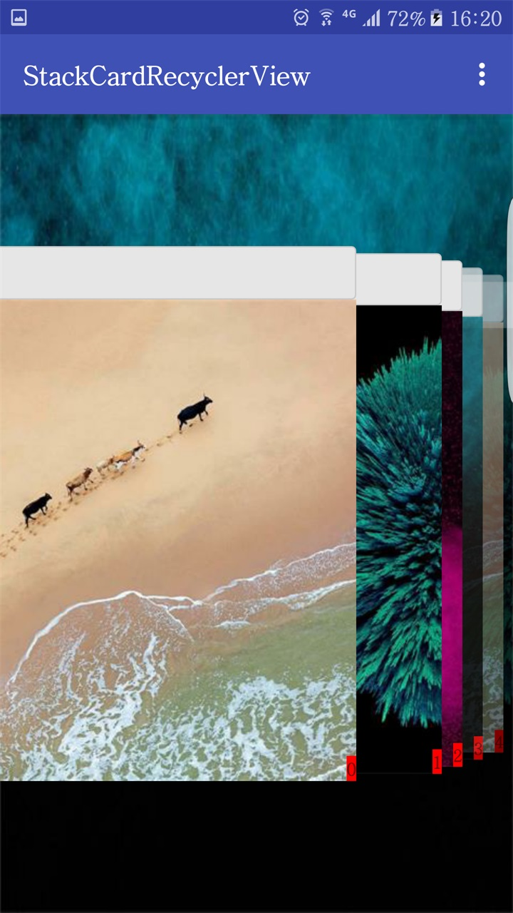
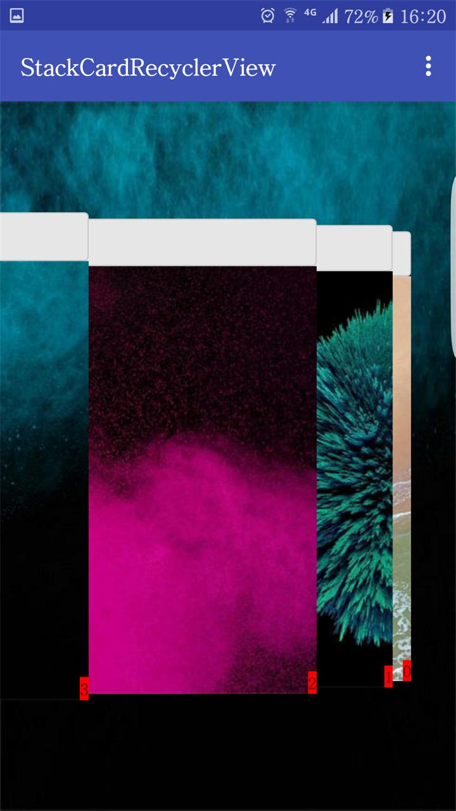
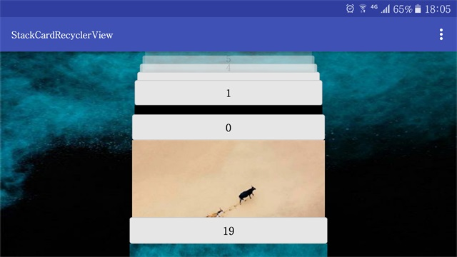
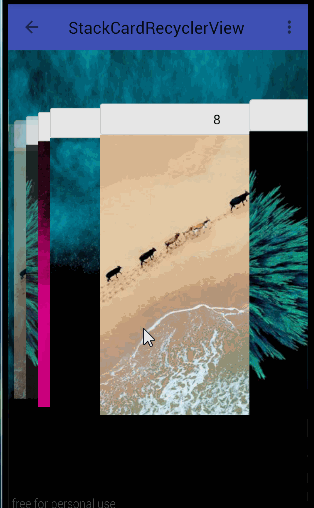
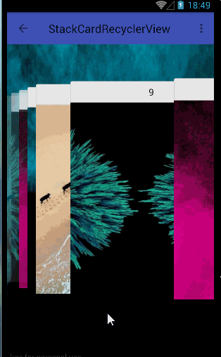

# StackCardRecyclerView
类似于Android 6.0最近任务
<br/>
<br/>


## View GIF ##

  
<Br/>
 

感谢 [CarouselLayoutManager](https://github.com/Azoft/CarouselLayoutManager) , 我参考了他的代码.

### dependencies ###
##### Maven Central #####
```xml
<dependency>
  <groupId>com.ckenergy.stackcardlayoutmanager</groupId>
  <artifactId>stackcardlayoutmanager</artifactId>
  <version>1.0.1</version>
  <type>pom</type>
</dependency>
```
##### Gradle #####
```
compile 'com.ckenergy.stackcardlayoutmanager:stackcardlayoutmanager:1.0.1'
```
##### Ivy #####
```xml
<dependency org='com.ckenergy.stackcardlayoutmanager' name='stackcardlayoutmanager' rev='1.0.1'>
  <artifact name='stackcardlayoutmanager' ext='pom' ></artifact>
</dependency>
```

### 有竖直（Vertical）和水平（Horizontal） 两种类型###
<br/> 

 

### 不管横向还是竖向都有卡片入栈和出栈堆叠模式(in stack and out stack) 和正反序排序模式(positive and negative) ###

#### 水平 ####

 * 1.正序, 入栈 
 * 2.正序, 出栈
<br/>
  

 * 3.反序, 入栈
 * 4.反序, 出栈
<br/>
 


### 高度或宽度不够的话会影响显示数量 ###

在竖直模式当宽度大于高度时，在水平模式当高度大于宽度时，都显示less模式

 * 1.less have 7 item
 * 2.more have 9 item
<br/>
  

### How to use? ###

- 默认创建的 new StackCardLayoutManager 正序和入栈模式,
你可以这样改变它们

``` java
StackCardLayoutManager stackCardLayoutManager = new StackCardLayoutManager(StackCardLayoutManager.VERTICAL,true, new StackCardPostLayout());
stackCardLayoutManager.setStackOrder(StackCardLayoutManager.OUT_STACK_ORDER);
stackCardLayoutManager.setNumberOrder(StackCardLayoutManager.NEGATIVE_ORDER);  
recyclerView.setLayoutManager(stackCardLayoutManager);
```

- 添加滑动事件swip listener 
<br/>

``` java
ItemTouchHelperCallBack itemTouchHelperCallBack = new ItemTouchHelperCallBack();
itemTouchHelperCallBack.setOnSwipListener(swipListener);
ItemTouchHelper itemTouchHelper = new ItemTouchHelper(itemTouchHelperCallBack);
itemTouchHelper.attachToRecyclerView(recyclerView);
```

- 添加自动对齐和点击移动事件
<br/>


``` java
// enable center post touching on item and item click listener
DefaultChildSelectionListener.initCenterItemListener(new DefaultChildSelectionListener.OnCenterItemClickListener() {
   @Override
   public void onCenterItemClicked(@NonNull final RecyclerView recyclerView, @NonNull final StackCardLayoutManager stackCardLayoutManager, @NonNull final View v) {
     final int position = recyclerView.getChildLayoutPosition(v);
     final String msg = String.format(Locale.US, "Item %1$d was clicked", position);
     Log.d("onCenterItemClicked", msg);
     Toast.makeText(BaseActivity.this, msg, Toast.LENGTH_SHORT).show();
   }
}, recyclerView, layoutManager);
```

### TODO ###

* 1.在5.0以下的过度绘制(我使用的 view.setClipBounds(rect) 这个方法来避免过度绘制，但是在5.0以下没有效果 )
* 2.需要在滑动起来时速度更快

#### License ####

	Copyright 2016 ckenergy <2ckenergy@gmail.com>
    Licensed under the Apache License, Version 2.0 (the "License");
    you may not use this file except in compliance with the License.
    You may obtain a copy of the License at

       http://www.apache.org/licenses/LICENSE-2.0

    Unless required by applicable law or agreed to in writing, software
    distributed under the License is distributed on an "AS IS" BASIS,
    WITHOUT WARRANTIES OR CONDITIONS OF ANY KIND, either express or implied.
    See the License for the specific language governing permissions and
    limitations under the License.